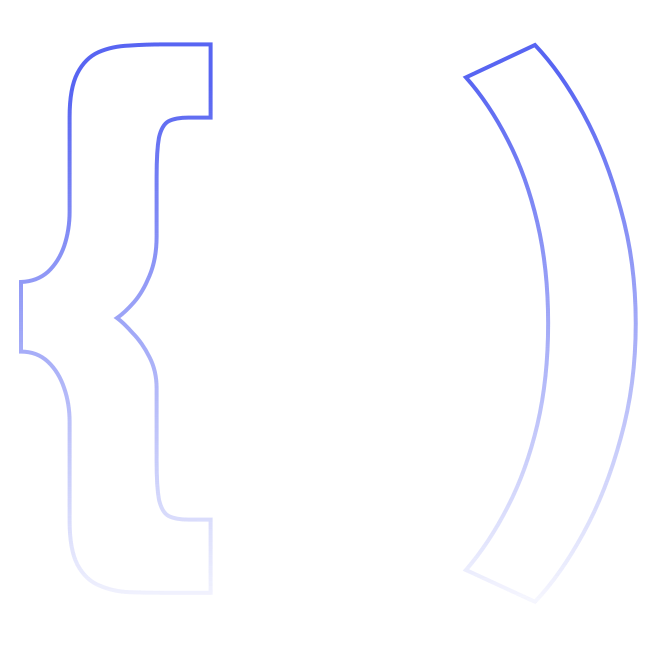

<h2>Hi, I'm Arthur ☕</h2>

Welcome to my profile that will be used to expose my personal projects and progress in my studies in the development area, my name is Arthur, but you can call me Coutinho, I am a full-stack developer passionate about computing, for sharing content, and by the information security area focused on offensive security. You can follow my main profile for documentation projects with socio-educational purposes. 

<h3>If you want to follow my content:</h3> 

   
  
  

  
  
   

   
  

